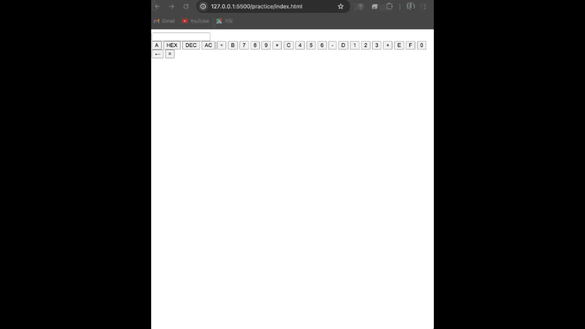
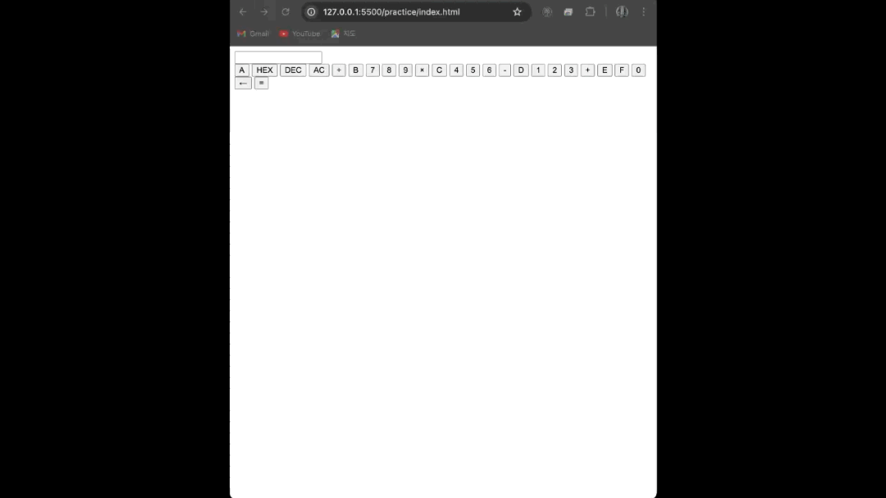
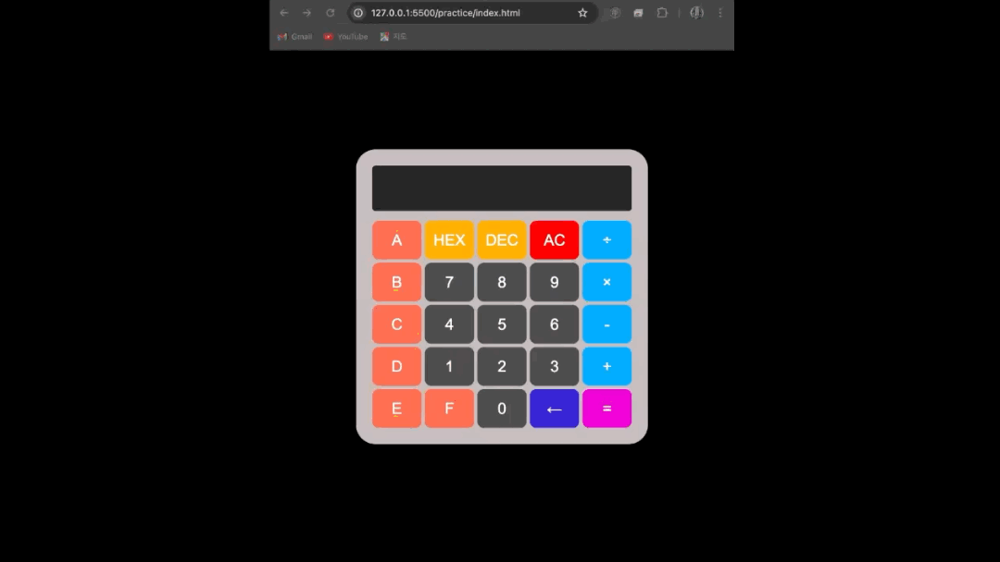

# Calculator Web Application

이 프로젝트는 간단한 **계산기 웹 애플리케이션**입니다. HTML, CSS, JavaScript를 사용하여 계산기 기능을 구현하였으며, 16진수(HEX)와 10진수(DEC) 간의 변환도 지원합니다.

## 파일 설명

- **index.html**: 계산기의 전체 구조를 담당하는 HTML 파일입니다. 각 버튼에 해당하는 이벤트와 관련된 기능들을 정의합니다.
- **style.css**: 계산기의 디자인을 설정하는 CSS 파일입니다. 계산기 배경, 버튼 스타일, 호버 효과 등을 포함하고 있습니다.
- **script.js**: 계산기 기능을 구현하는 JavaScript 파일입니다. 숫자 입력, 연산 기능, 16진수와 10진수 간의 변환 등을 처리합니다.

## 주요 기능

1. **기본 계산 기능**: 
    - 덧셈(+), 뺄셈(-), 곱셈(×), 나눗셈(÷)을 지원합니다.
    - 입력된 수식은 `eval()`을 이용해 계산됩니다.

2. **16진수 및 10진수 변환**:
    - `HEX` 버튼을 눌러 현재 10진수 숫자를 16진수로 변환합니다.
    - `DEC` 버튼을 눌러 현재 16진수 숫자를 10진수로 변환합니다.

3. **기타 기능**:
    - **AC** 버튼을 눌러 입력된 내용을 모두 지울 수 있습니다.
    - **←** 버튼을 눌러 마지막으로 입력된 문자를 삭제할 수 있습니다.

## 사용 기술

- **HTML**: 계산기 UI를 작성하고 구조를 정의합니다.
- **CSS**: 스타일링을 통해 계산기를 깔끔하고 직관적으로 만듭니다.
    - 버튼 호버 효과 및 색상 강조를 통해 사용자의 편의성을 높였습니다.
- **JavaScript**: 계산기의 주요 기능을 구현합니다.
    - **`input()`**: 버튼을 클릭했을 때 숫자나 연산자를 입력합니다.
    - **`clearDisplay()`**: 디스플레이를 지웁니다.
    - **`deleteLast()`**: 마지막에 입력한 문자를 삭제합니다.
    - **`convertToHex()`**: 디스플레이의 10진수를 16진수로 변환합니다.
    - **`convertToDec()`**: 디스플레이의 16진수를 10진수로 변환합니다.
    - **`calculateResult()`**: 입력된 수식을 계산합니다.

## 코드 예시

### index.html

```html
<!DOCTYPE html>
<html lang="ko">
<head>
    <meta charset="UTF-8">
    <meta name="viewport" content="width=device-width", initial-scale="1.0">
    <title>계산기</title>
    <link rel="stylesheet" href="style.css">
</head>
<body>
    <div class="calculator">
        <input type="text" id="display" readonly>
        <div class="buttons">
            <button class="hex" onclick="input('A')">A</button>
            <button class="hexdex" onclick="convertToHex()">HEX</button>
            <button class="hexdex" onclick="convertToDec()">DEC</button>
            <button class="clear" onclick="clearDisplay()">AC</button>
            <button class="operation" onclick="input('/')">÷</button>
            <button class="hex" onclick="input('B')">B</button>
            <button onclick="input('7')">7</button>
            <button onclick="input('8')">8</button>
            <button onclick="input('9')">9</button>
            <button class="operation" onclick="input('*')">×</button>
            <button class="hex" onclick="input('C')">C</button>
            <button onclick="input('4')">4</button>
            <button onclick="input('5')">5</button>
            <button onclick="input('6')">6</button>
            <button class="operation" onclick="input('-')">-</button>
            <button class="hex" onclick="input('D')">D</button>
            <button onclick="input('1')">1</button>
            <button onclick="input('2')">2</button>
            <button onclick="input('3')">3</button>
            <button class="operation" onclick="input('+')">+</button>
            <button class="hex" onclick="input('E')">E</button>
            <button class="hex" onclick="input('F')">F</button>
            <button onclick="input('0')">0</button>
            <button class="erase" onclick="deleteLast()">←</button>
            <button class="equal"onclick="calculateResult()">=</button>

        </div>
    </div>
    <script src="script.js"></script>
</body>
</html>
```
### 실행화면(html로 간단하게 버튼들만 표시)


### script.js

```js
function input(value) {
    const display = document.getElementById("display");
    display.value += value;
}

function clearDisplay() {
    document.getElementById("display").value = "";
}

function deleteLast() {
    const display = document.getElementById("display");
    display.value = display.value.slice(0, -1); 
}

function convertToHex() {
    const display = document.getElementById("display");
    const decimalValue = parseInt(display.value, 10);
    if (!isNaN(decimalValue)) {
        display.value = decimalValue.toString(16).toUpperCase();
    }
}

function convertToDec() {
    const display = document.getElementById("display");
    const hexValue = display.value;
    if (/^[0-9A-F]+$/i.test(hexValue)) {
        display.value = parseInt(hexValue, 16).toString(10);
    }
}

function calculateResult() {
    const display = document.getElementById("display");
    try {
        display.value = eval(display.value.replace(/×/g, '*').replace(/÷/g, '/')); 
    } catch {
        display.value = "Error";
    }
}
```
### 실행화면(버튼을 누르면 디스플레이창에 표시하고 계산하는것을 구현)


### style.css

```css
/* 계산기 뒤에 배경색깔 */
body {
    background-color: #000000; 
    display: flex;
    justify-content: center;
    align-items: center;
    height: 100vh;
    margin: 0;
    font-family: Arial, sans-serif;
}

/* 계산기 틀 디자인 */
.calculator {
    width: 400px;
    background-color: #c2b6b6;
    padding: 25px;
    border-radius: 30px; /*굴곡지게하기*/
}

/* 숫자나오는칸 창조절 */
#display {
    width: 95%;
    height: 50px;
    font-size: 2em;
    text-align: right;
    margin-bottom: 15px;
    padding: 10px;
    border: none;
    border-radius: 5px; /*굴곡*/
    background-color: #222;
    color: #fff;
}

/* 버튼 */
.buttons {
    display: grid;
    grid-template-columns: repeat(5, 1fr);
    gap: 5px; /*버튼끼리간격*/
}

/* 버튼 스타일 */
button {
    height: 60px;
    font-size: 1.5em;
    border: none;
    border-radius: 10px;
    background-color: #444;
    color: #fff;
    cursor: pointer;
    transition: background-color 0.3s ease;
}

/* 버튼누를때 번쩍 */
button:hover {
    background-color: #555;
}

/*HEX랑 DEC 색깔*/
button:nth-child(2),
button:nth-child(3) {
    background-color: #ffa600; 
}

.hexdex:hover {
    background-color: #fff347; 
}


button:nth-child(4) {
    background-color: #ff0000; 
}

.clear:hover {
    background-color: #ff477e; 
}


button:nth-child(5),
button:nth-child(10),
button:nth-child(15),
button:nth-child(20)  {
    background-color: #00a2ff; 
}

.operation:hover {
    background-color: #477eff; 
}


button:nth-last-child(2){
    background-color: #3221cf; 
}

.erase:hover {
    background-color: #b847ff; 
}


button:nth-last-child(1){
    background-color: #ef02d3; 
}

.equal:hover {
    background-color: #ff478a; 
}


/*ABCDE 색깔*/
button:nth-last-child(25),
button:nth-last-child(20),
button:nth-last-child(15),
button:nth-last-child(10),
button:nth-last-child(5),
button:nth-last-child(4) {
    background-color: #ff6347; 
}

.hex:hover {
    background-color: #ffa047; 
}
```

### 실행화면()

